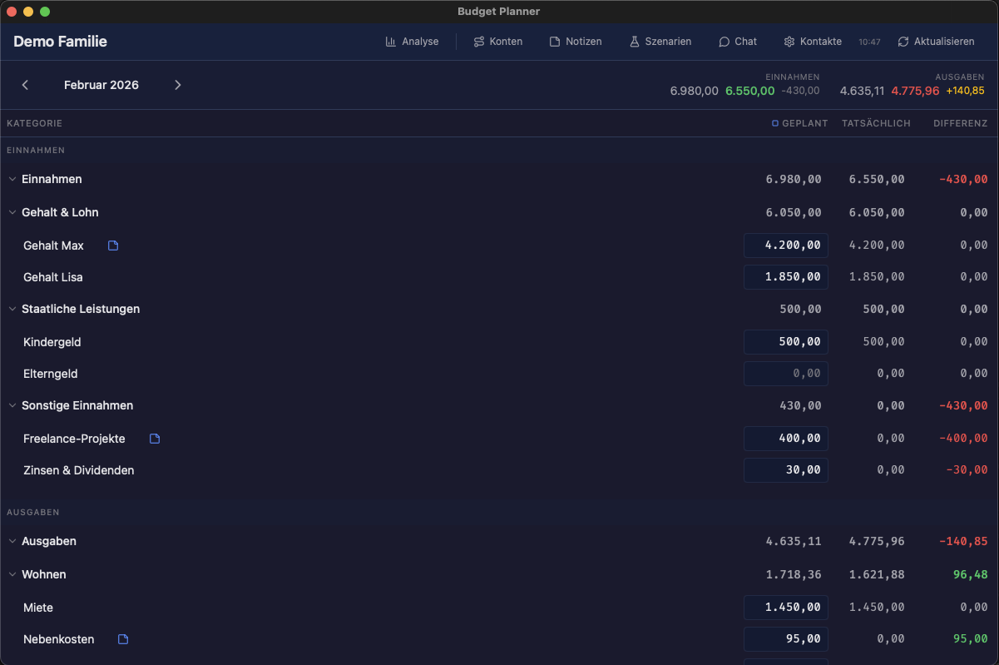
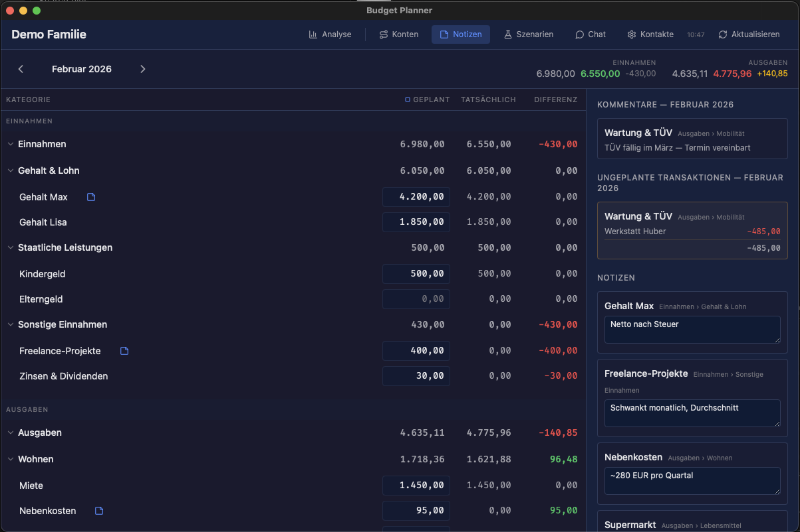
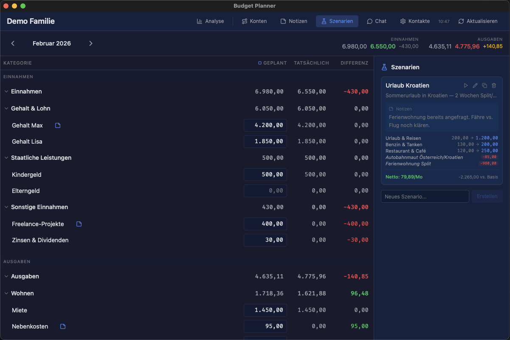

# Budget Planner for MoneyMoney

A macOS desktop budgeting app that connects to MoneyMoney and turns your categories and transactions into a clear monthly plan vs. actual view.

## Who It's For
- You use MoneyMoney on macOS.
- You want a simple, month-by-month budget with planned vs. actual spending.
- You prefer a local, desktop-first workflow.

## What It Does
- Reads categories and transactions from MoneyMoney via AppleScript.
- Shows income and expense categories in a single monthly table.
- Lets you set planned amounts per category and see the difference to actuals.
- Supports line items per category, category exclusion, and optional account routing.
- Saves your budget templates locally and remembers your settings.

## Using the App (End Users)
1. Install and open MoneyMoney at least once, and unlock its database.
2. Launch Budget Planner.
3. When macOS asks for permission to control MoneyMoney, allow it.
4. Pick the month at the top, and choose which accounts to include.
5. Edit planned amounts in the table; actuals update from MoneyMoney.
6. Save with the **Speichern** button or `Cmd+S`.

## Data & Privacy
- Budget templates are saved locally as JSON in `~/.budgetplanner/budgets`.
- Transactions and categories are fetched from MoneyMoney on demand and kept in memory.
- The app does not write anything back to MoneyMoney.

## Troubleshooting
- **MoneyMoney is not running**: Open MoneyMoney and try again.
- **Database locked**: Unlock MoneyMoney's database and refresh.
- **Access denied**: macOS System Settings -> Privacy & Security -> Automation -> allow Budget Planner to control MoneyMoney.

## Demo Mode

You can run the app without MoneyMoney using built-in dummy data. This is useful for demos, development on non-Mac machines, and onboarding.

```bash
npm run dev:demo
```

The demo simulates a German family household budget ("Familie Müller") with 5 accounts, ~35 categories, and 50-80 realistic transactions per month. Transactions are deterministic — the same month always produces the same data.

### Budget table with planned vs. actual

The main view shows all income and expense categories with planned amounts, actual spending from transactions, and the difference. Categories are organized in a hierarchy matching a typical German household.



### Notes and unplanned expenses

The notes panel shows per-category comments and highlights unplanned transactions — expenses that weren't part of the original budget (e.g. an unexpected car repair).



### What-if scenarios

The scenario panel lets you model budget changes before committing them. The demo includes a pre-built "Urlaub Kroatien" scenario with overrides for travel, fuel, and dining, plus virtual items like highway tolls and accommodation.



## Development

Prereqs:
- Node.js (LTS recommended)
- Rust toolchain (for Tauri)
- macOS (MoneyMoney integration, not needed for demo mode)

Install dependencies:
```bash
npm install
```

Run the app in dev mode:
```bash
npm run tauri dev
```

Run in demo mode (no MoneyMoney required):
```bash
npm run dev:demo
```

Build the app:
```bash
npm run tauri build
```

## Project Structure
- `src/`: SvelteKit frontend
- `src-tauri/`: Tauri (Rust) backend + app config

## License
MIT License. See `LICENSE`.
